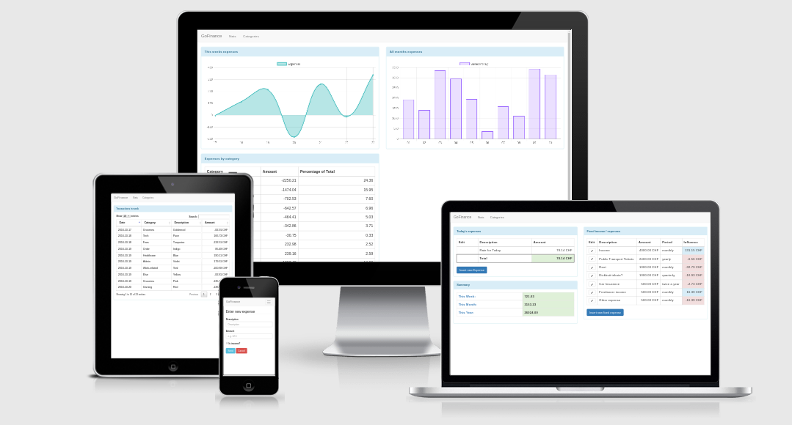

# GoFinance

a simple web application to aid in financial control through a daily "magic number"

## Installation

Since this in written and built with Go, just download the appropriate release for your platform, unpack and you're good to go! The database will be created for you on the first run - in the same directory as the executable resides (for command line users: in your current working directory).

## Usage

0. Go to `http://localhost:8080`
1. Enter your fixed expenses (like rent or other stuff that is not mutable but recurrent)
2. This calculates your "magic number", your daily amount of money you can spend
3. Enter each new expense you have. There is no categorization, since I always found those to be too tedious to make it a habit
4. Have control over your finances - purchase for purchase, day after day!
5. You can manage categorization afterwards under "Categories" - you freely choose a categorization scheme for all your expenses. Expenses with the same name will receive the same category (so e.g. every Transaction with the name "Supermarket" will be categorized under "Groceries")

## Contributing

1. Fork it!
2. Create your feature branch: `git checkout -b my-new-feature`
3. Commit your changes: `git commit -am 'Add some feature'`
4. Push to the branch: `git push origin my-new-feature`
5. Submit a pull request :D

## History

* Late 2014 - First implementation in MeteorJS
* October 2016 - complete Rewrite in GO for fun and learning

## For Developers

1. make sure your $GOPATH is set
2. go get github.com/julienschmidt/httprouter
3. go build

## Credits

Thanks to Alex Recker who wrote his blogpost "Our New Sid Meier's Civilization Inspired Budget".
If you haven't read it, do it now! -> [Here (Archive link)](https://web.archive.org/web/20161113235648/https://alexrecker.com/our-new-sid-meiers-civilization-inspired-budget.html)

## Similar Projects

If you liked this simple one, here are some other projects that could fit your way of handling things. Thanks to [Catpn3m0](https://github.com/captn3m0) for the suggestions.

https://github.com/jwilson/frugal
https://github.com/arecker/moolah
https://github.com/EorlBruder/CivBudget

### Packages used
- [httprouter](https://github.com/julienschmidt/httprouter) by Julien Schmidt
- [go-sqlite3](https://github.com/mattn/go-sqlite3) by Yasuhiro Matsumoto (a.k.a mattn)

## License

GoFinance is licensed under the GPLv3, see LICENSE.md

## Author
Matthias Fluor
